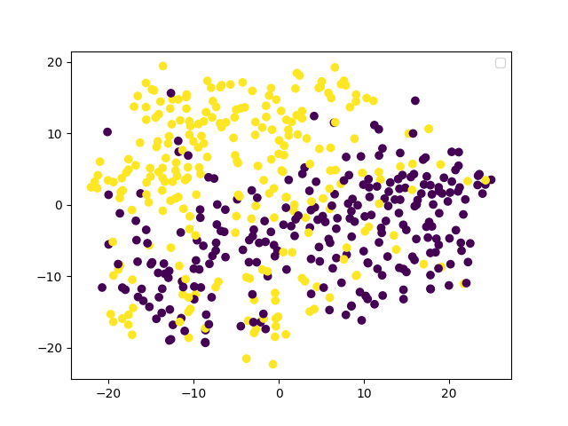
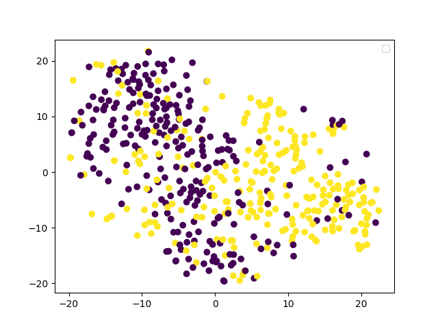

# 总结
假设我们的目标是一个分类任务， 再简化一下为二分类。  
直接在原始的图片上进行分类，图片上的杂讯太多,或者说和问题无关的信息太多.  
所以需要降低维度，这里方法就比较多了， 比如AE， PCA 等，得到一个低纬度的表示方式  
因为在降低维度的时候，我们保留的是主要的特征，所以会去掉一些杂讯  
降低维度后我们可以用这个来得到最终的效果  
如果是其他的任务， 或者多分类，这里里面就需要自己来设计一些小的技巧了，  
比如说，我们通过

|*|改进方法|loss| p1 cluster | p2 | p3 | 
|---| ---| ---|--- | ---- | ---- |
|baseline 0|-|-|||||
|1|加上了BN|epoch [100/100], loss:5.06923||  |
|2|[-1,1]->[0,1]的normalization 效果差了一些|-|0.649 | ||

