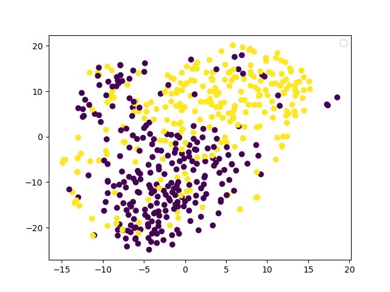
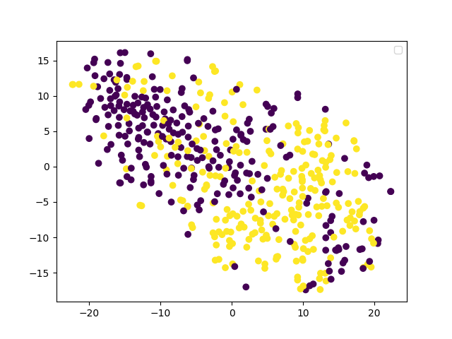

# 总结
假设我们的目标是一个分类任务， 再简化一下为二分类。  
直接在原始的图片上进行分类，图片上的杂讯太多,或者说和问题无关的信息太多.  
所以需要降低维度，这里方法就比较多了， 比如AE， PCA 等，得到一个低纬度的表示方式  
因为在降低维度的时候，我们保留的是主要的特征，所以会去掉一些杂讯  
降低维度后我们可以用这个来得到最终的效果  
如果是其他的任务， 或者多分类，这里里面就需要自己来设计一些小的技巧了，  
比如说，我们通过

|*|改进方法|loss| p1 cluster | p2 | p3 | 
|---| ---| ---|--- | ---- | ---- |
|baseline 0|-|-|0.636 ||||
|0-1|加上了BN|epoch [100/100], loss:5.06923|0.738 |  |
|0-2|[-1,1]->[0,1]的normalization 去掉BN 效果差了一些|-|0.649 | ||
|2-3|VH flip 数据增强 去掉BN|-|0.718 | ||
|3-4|BN 和数据增强|epoch [100/100], loss:1.46576|0.778| ||
|4-5|通过调节学习率使之收敛,隐向量小狗恢复的还比较不错 |-|0.812| ||
|5-6|模型增大一倍 这个数据丢掉了 数据增强去掉了不小心|-|0.8| ||
|6-7 实际是6|之前的laten code 是（256，4，4） 改为（256，1，1）数据增强去掉了不小心|-|0.786 | ||
|6-7 |翻卷集全部用stride=1 增加全局信息 并加上数据增强 维度太小学不出来了|-|0.794 | ||

|8|模型增大一倍 code（256，4，4） +数据增强|-|0.794 | ||
|9|8的模型，然后调节PCA 和TSNE 效果反而降低了
laten code的维度大小要调试可以比原始数据多， 数据增强肯定要， 模型大小也需要
